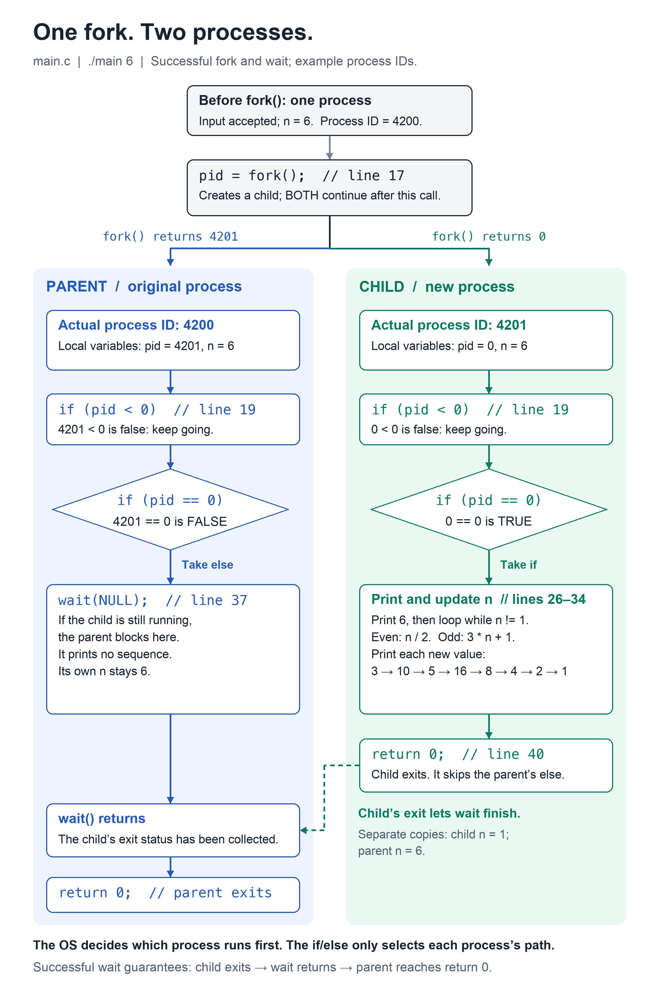
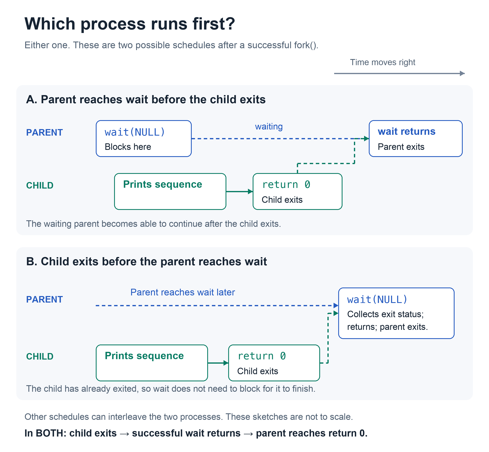

# How the parent and child work in `main.c`

**`fork()` creates a second process. Both continue after the call, but they receive different return values. The `if` checks those values to choose what each process does.**

This walkthrough uses `./main 6` and the line numbers in [main.c](main.c). Process IDs `4200` and `4201` are examples; the operating system chooses the real IDs. Both diagrams are local PNGs and display in a normal Markdown preview.



## 1. What `pid = fork()` actually does

Before line 17, there is one process. It has already checked the input and stored `6` in `n`.

```c
pid = fork();  // line 17
```

On success, `fork()` creates a child with its own copy of the parent's memory. **Both processes resume at this call's return, store their respective return values in their own `pid`, and continue to line 19.** The child does not restart `main()` or repeat the input check.

| Where `fork()` returns | Value stored in that process's `pid` | Meaning |
| --- | --- | --- |
| Parent, after success | A positive number, such as `4201` | This is the child's actual process ID. |
| Child | `0` | This return value identifies the child side of the fork. |
| Original process, after failure | `-1` | No child was created. |

There is no one shared `pid` changing back and forth between `4201` and `0`. There are **two separate copies**.

The variable name `pid` can be misleading: the child's `pid` variable is `0`, but its actual process ID is `4201` in this example. `getpid()` would return its actual ID. We compare the **return value from `fork()`** to identify which process is running this copy of the code.

## 2. How checking for zero selects the child

Both processes first reach the failure check:

```c
if (pid < 0) {                 // line 19
    fprintf(stderr, "fork failed\n");
    return 1;
}
```

With a successful fork, the parent checks `4201 < 0` and the child checks `0 < 0`. Both are false, so both skip this error block. If `fork()` returned `-1`, only the original process would exist; it would print the error and exit here.

Next, **both processes independently evaluate the same condition**:

```c
if (pid == 0) {                // line 24
    // Generate and print the sequence.
} else {                      // line 35
    wait(NULL);
}
```

| Process | Its value of `pid` | Comparison it performs | Result | Branch it executes |
| --- | --- | --- | --- | --- |
| Parent | `4201` | `4201 == 0` | False | `else`: wait for the child. |
| Child | `0` | `0 == 0` | True | `if`: print the sequence. |

- **`=` assigns:** `pid = fork()` stores the function's return value.
- **`==` compares:** `pid == 0` asks whether the stored value equals zero. It does not change `pid`.
- In C, a comparison produces `1` for true or `0` for false. So the child's **variable is `0`**, but its **comparison result is `1` (true)**. That is why it enters the `if` body.

Each process takes exactly one branch. After finishing the `if` body, the child skips the `else` and reaches line 40. The parent skips the entire child body and enters the `else` directly.

## 3. Does the child run first because its code comes first?

**No. Source-code order determines the steps within each process; the operating system's scheduler decides when each process gets CPU time.**

The child can run first, the parent can run first, or they can take turns. On different CPU cores, they may also run at the same time. The parent does not have to wait for the child to evaluate its `if` before evaluating its own copy.



The diagrams show two possible schedules, not a fixed duration or an exhaustive list of schedules.

**If the parent reaches `wait(NULL)` first:** it blocks until the child exits, assuming the wait succeeds. While blocked, it is sleeping rather than repeatedly checking `pid`. The child continues calculating and printing. After the child exits, the parent can resume, collect the exit status, return from `wait()`, and reach its own `return 0`.

**If the child exits first:** the OS retains its exit information until the parent collects it. When the parent later calls `wait(NULL)`, it can collect that information without waiting for the child to finish running.

For a successful wait, the guaranteed order is:

```text
child exits → parent's wait() returns → parent reaches return 0
```

`wait(NULL)` does not make the child start first. It prevents the parent from continuing past a successful wait until the child has exited. `NULL` means the parent does not request a copy of the child's exit status; the child is still waited for and cleaned up. The program ignores `wait()`'s return value, so the diagrams assume it succeeds.

## 4. Why the numbers still print in order

Only the child prints the sequence. Inside that one process, the statements execute in order:

1. Print the initial `n`, which is `6` (line 26).
2. Check whether `n != 1` (line 27).
3. If `n` is even, divide it by `2`; otherwise calculate `3 * n + 1` (lines 28–32).
4. Print the new `n` (line 33), then check the loop condition again.
5. When `n` becomes `1`, it has already been printed. The next loop check is false, so the child leaves the loop and returns from `main()`.

For `./main 6`, this prints **6 → 3 → 10 → 5 → 16 → 8 → 4 → 2 → 1**, one number per line. Scheduling can affect when those numbers appear, but it does not reorder the child's instructions. The parent contributes no sequence output.

The child's `n` ends at `1`. The parent's separate copy stays `6`.

## 5. Both processes reach `return 0`

```c
return 0;                     // line 40
```

Both processes execute this line independently. Returning from `main()` exits the process that executes it. With a successful wait, the child exits first and the parent exits afterward.

This `0` is an **exit status meaning success**. It is separate from the `0` returned by `fork()` in the child, and it does not assign anything to `pid`.

To check your understanding, trace `./main 1`: the child prints `1` once and skips the loop. The parent still takes the `else` and calls `wait(NULL)`, regardless of which process runs first.
